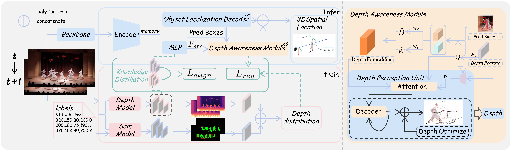

# DepTR-MOT
[](https://github.com/warriordby/DepTR-MOT/stargazers)
[](https://github.com/warriordby/DepTR-MOT/issues)
[](https://www.python.org/)
[](https://pytorch.org/)
[](https://arxiv.org/abs/2509.17323v1)

---
DepTR-MOT is a depth-aware DETR-based multi-object tracker designed to improve robustness in robotic environments with dense targets and frequent occlusions. By leveraging instance-level depth cues through foundation-model-based soft depth supervision and dense depth distillation, DepTR-MOT refines trajectories without extra computation during inference. Experiments on QuadTrack and DanceTrack datasets demonstrate significant improvements, achieving HOTA scores of 27.59 and 44.47, respectively, and showing superior performance in occlusion and close-proximity scenarios.
---

---
<!-- 
--- -->
## 📚 Reference

- [DFINE](https://github.com/Peterande/D-FINE)  
- [SAM2](https://github.com/facebookresearch/sam2)  
- [Video Depth Anything](https://github.com/DepthAnything/Video-Depth-Anything)  

---

## 📖 Table of Contents

- [1. Clone Repository](#1-clone-repository)  
- [2. Set Up Environment](#2-set-up-environment)  
- [3. Download Pretrained Models](#3-download-pretrained-models)  
- [4. Install SAM2](#4-install-sam2)  
- [5. Training](#5-training)  
- [6. Testing](#6-testing)  
- [7. Visualization](#7-visualization)  

---

## 1. Clone Repository

```bash
git clone https://github.com/warriordby/DepTR-MOT.git
cd DepTR-MOT
````

---

## 2. Set Up Environment

Create and activate a Conda environment:

```bash
conda env create -f environment.yml
conda activate deptr
```

---

## 3. Download Pretrained Models

```bash
# SAM2 checkpoint
wget https://dl.fbaipublicfiles.com/segment_anything_2/092824/sam2.1_hiera_tiny.pt \
  -O ./SAM2/checkpoints/sam2.1_hiera_tiny.pt

# Video Depth Anything checkpoint
wget https://hf-mirror.com/depth-anything/Video-Depth-Anything-Small/resolve/main/video_depth_anything_vits.pth \
  -O ./VideoDepthAnything/video_depth_anything_vits.pth
```

---

## 4. Install SAM2

```bash
cd SAM2
pip install -e .
cd ..
```

---

## 5. Training

Train the model on multiple GPUs:

```bash
# Example: 2 GPUs
CUDA_VISIBLE_DEVICES=0,1 torchrun --master_port=4444 --nproc_per_node=2 train.py \
  -c configs/dfine/custom/dfine_hgnetv2_l_custom.yml --use-amp --seed=0
```

---

## 6. Testing

Single-GPU testing:

```bash
CUDA_VISIBLE_DEVICES=0 torchrun --master_port=7777 --nproc_per_node=1 train.py \
  -c configs/dfine/custom/dfine_hgnetv2_l_custom.yml --test-only \
  -r ./output/dfine_hgnetv2_l_custom/last.pth
```

---

## 7. Visualization

Visualize detection results:

```bash
CUDA_VISIBLE_DEVICES=0 torchrun --master_port=7777 --nproc_per_node=1 train.py \
  -c configs/dfine/custom/dfine_hgnetv2_l_custom.yml --test-only \
  -r ./output/dfine_hgnetv2_l_custom/last.pth -v
```

<!-- --- -->
<!-- 
## 8. TODO

* [ ] Add multi-GPU testing instructions
* [ ] Add example datasets and results
* [ ] Include model evaluation metrics
* [ ] Add detailed troubleshooting guide
* [ ] Add GIF or screenshot examples in README -->